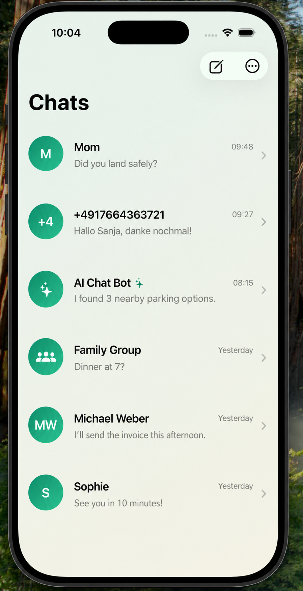

# Connect Chat

Connect Chat is a microservice-based chat backend for a mobile messaging product. The repository contains the core services for identity, group membership, realtime chat delivery, message persistence, presence tracking, AI bot replies, and an MCP adapter for external service integrations.

The iOS UI is maintained separately in [chat-ios](https://github.com/DamiBeGud/chat-ios).

<p align="center">
  
</p>

## Repository Map

| Path | Description |
| --- | --- |
| `identity-service` | Spring Boot service for user registration, SMS verification, JWT access/refresh tokens, internal service tokens, and user lookup. |
| `group-service` | Spring Boot service for creating groups, managing group members, and authorizing group access. |
| `chat-service` | Spring Boot WebSocket service for private and group chat messages, delivery/read acknowledgements, outbox processing, and AI bot routing. |
| `message-storage-service` | Spring Boot service that consumes chat events, stores messages in Cassandra, tracks delivery state, and exposes undelivered messages. |
| `presence-service` | Spring Boot service that stores active user sessions in Redis and exposes online/presence lookup APIs. |
| `ai-service` | Python FastAPI/RabbitMQ worker that consumes bot inbox messages, calls Google Gemini, optionally invokes MCP tools, and publishes replies back to chat-service. |
| `ride-and-park-mcp-server` | Python HTTP MCP adapter exposing read-only tools for the external RideAndPark API to the AI service. |
| `k8s/local` | Local Kubernetes manifests and notes. |

## External Repositories

- Mobile UI: [https://github.com/DamiBeGud/chat-ios](https://github.com/DamiBeGud/chat-ios)
- RideAndPark external project: [https://github.com/RideAndPark/RideAndPark](https://github.com/RideAndPark/RideAndPark)
- RideAndPark contributors: [@lukasp1209](https://github.com/lukasp1209), [@RafaelSwitala](https://github.com/RafaelSwitala), [@Semineytor4](https://github.com/Semineytor4)

## Architecture

The chat platform is built around small services with explicit storage and communication boundaries:

- PostgreSQL stores identity, group, chat outbox/inbox, and storage inbox metadata.
- Cassandra stores message history and undelivered-message projections.
- Redis stores short-lived presence sessions.
- RabbitMQ carries private message, group message, status, bot inbox, and AI reply events between services.
- WebSocket/STOMP clients connect to `chat-service` for realtime messaging.
- `ai-service` behaves like a bot user and replies through the same chat pipeline as normal private messages.
- RideAndPark is maintained as a separate project; this repository only keeps the MCP adapter needed by the AI bot.

## Run Locally

### Prerequisites

- Java 21
- Docker Desktop
- Python 3.11+ for `ai-service` and `ride-and-park-mcp-server` development

Verify Java:

```bash
java -version
```

### 1. Start Local Infrastructure

Before starting Docker, make the init scripts executable:

```bash
chmod +x .infra/postgres/init-multiple-dbs.sh
chmod +x .infra/cassandra/create-keyspace.sh
```

The local stack starts:

- PostgreSQL
- pgAdmin
- Redis
- Cassandra
- RabbitMQ
- RideAndPark MCP server
- AI service

Run:

```bash
docker compose up -d
```

Useful local endpoints:

- PostgreSQL: `localhost:5432`
- pgAdmin: `http://localhost:5050`
- RabbitMQ UI: `http://localhost:15672`
- Redis: `localhost:6379`
- Cassandra: `localhost:9042`
- RideAndPark MCP server: `http://localhost:8080`

If you already started PostgreSQL or Cassandra before fixing script permissions, recreate the volumes so initialization runs again:

```bash
docker compose down -v
docker compose up -d
```

### 2. Load Local Environment Variables

From the project root:

```bash
set -a
source .env
set +a
```

This enables the `local` Spring profile and provides the local ports and dependency settings for all services.

### 3. Start the Spring Services

Each Spring Boot service can be started from its own directory with:

```bash
./gradlew bootRun
```

Example:

```bash
cd identity-service
./gradlew bootRun
```

For hot reload during local development, keep the service running in one terminal and run continuous compilation in another terminal:

```bash
cd identity-service
./gradlew --continuous recompileOnChange
```

Spring Boot DevTools will restart the running service whenever Gradle recompiles changed code.

Default local ports:

- `identity-service`: `8081`
- `group-service`: `8082`
- `chat-service`: `8083`
- `message-storage-service`: `8084`
- `presence-service`: `8085`
- `ride-and-park-mcp-server`: `8080`

If you want to use RideAndPark tools locally, run the external RideAndPark project separately and set:

```bash
RIDE_AND_PARK_API_BASE_URL=http://localhost:3000/api
```

When using Docker Compose from this repository, the default MCP adapter value is `http://host.docker.internal:3000/api`, which targets a RideAndPark backend running on the host machine.

### AI Bot Setup

The AI bot is addressed through normal private messaging, so the configured `AI_BOT_PHONE_NUMBER` must resolve to a real identity-service user. Identity-service Flyway migration `V7__seed_ai_bot_user.sql` seeds the default bot user:

- `AI_BOT_USER_ID`: `00000000-0000-0000-0000-000000000001`
- `AI_BOT_PHONE_NUMBER`: `+10000000000`

Set `GOOGLE_API_KEY` in your local environment before using the bot. The Python service consumes only `BotMessageCommand` messages from its bot inbox queue and sends replies back to chat-service as `AiPrivateReplyCommand`; chat-service remains responsible for creating the final private message outbox row.

## Service READMEs

Each microservice has its own README with responsibilities, dependencies, local run instructions, and key endpoints or message flows:

- `identity-service/README.md`
- `group-service/README.md`
- `chat-service/README.md`
- `message-storage-service/README.md`
- `presence-service/README.md`
- `ai-service/README.md`
- `ride-and-park-mcp-server/README.md`

## Zed Tasks

If you use Zed, project tasks are available to start each service individually or all of them at once from `.zed/tasks.json`.

## Notes

- Local Spring configuration is in each service's `application-local.yaml`.
- Kubernetes/container Spring configuration is in each service's `application-k3s.yaml`.
- Local Docker infrastructure is defined in `docker-compose.yml`.
- RideAndPark application code lives in the external RideAndPark repository, not in this repository.
